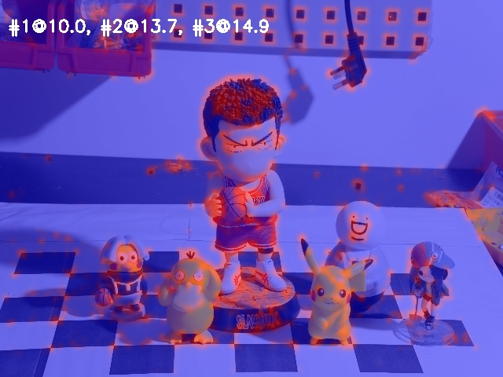
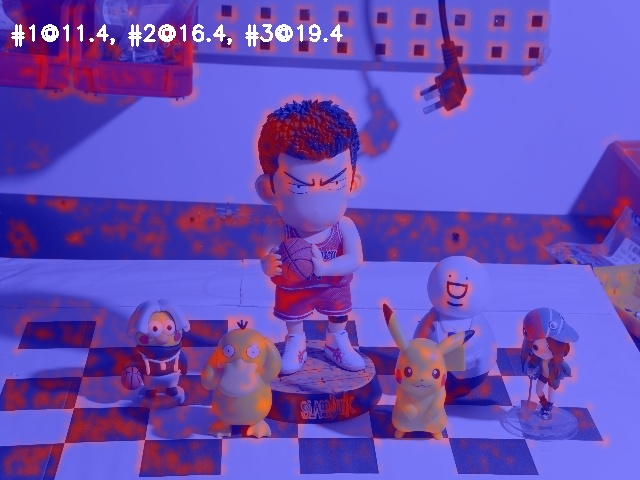
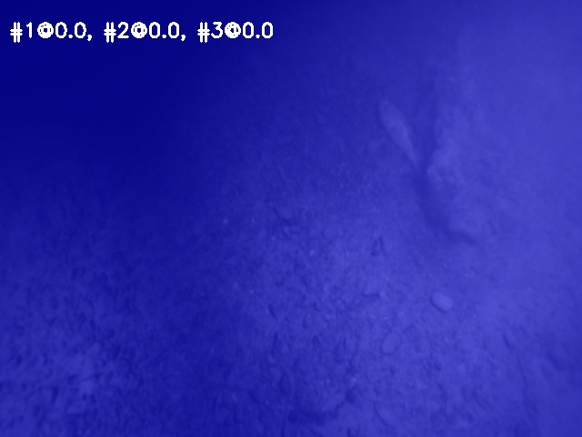
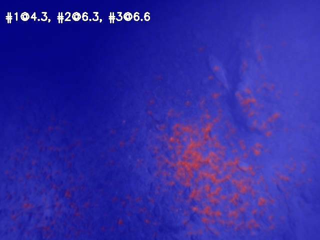
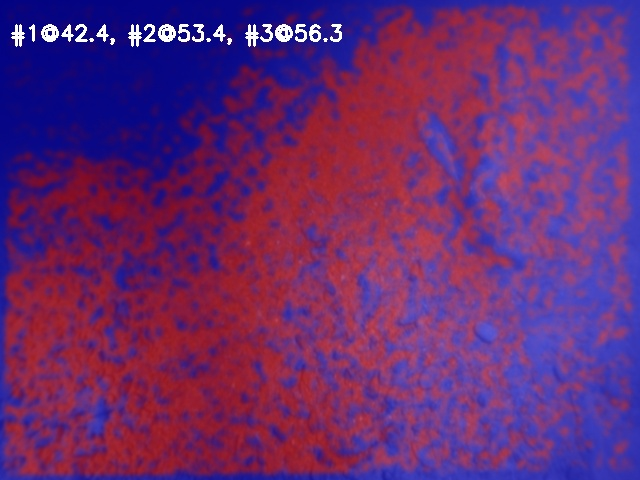

# LET-NET2：An end-to-end lightweight CNN designed for sparse corner extraction and tracking.

LET-NET2 transforms the traditional LK optical flow process into a neural network layer by computing its derivatives, enabling end-to-end training of sparse optical flow. It preserves the original lightweight network structure and, during training on simulated datasets, autonomously learns capabilities such as edge orientation extraction and active enhancement of weak-texture regions. As a result, it demonstrates stronger tracking performance under challenging conditions, including dynamic lighting, weak textures, low illumination, and underwater blur.

## Effect of Tracking Region Comparison on Weak-Texture and Low-Light Performance

<table align="center">
  <tr>
    <th style="text-align:center;font-size:16px;">Original LK Optical Flow</th>
    <th style="text-align:center;font-size:16px;">LETNet</th>
    <th style="text-align:center;font-size:16px;">LETNet2</th>
  </tr>
  <tr>
    <td align="center"></td>
    <td align="center"></td>
    <td align="center"></td>
  </tr>
  <tr>
    <td align="center"></td>
    <td align="center"></td>
    <td align="center"></td>
  </tr>
</table>

## Train

## Interface 

## VINS-Fusion Integration

